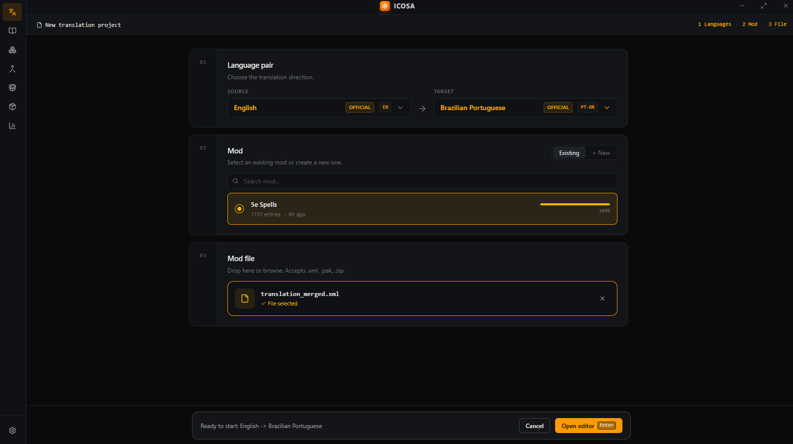
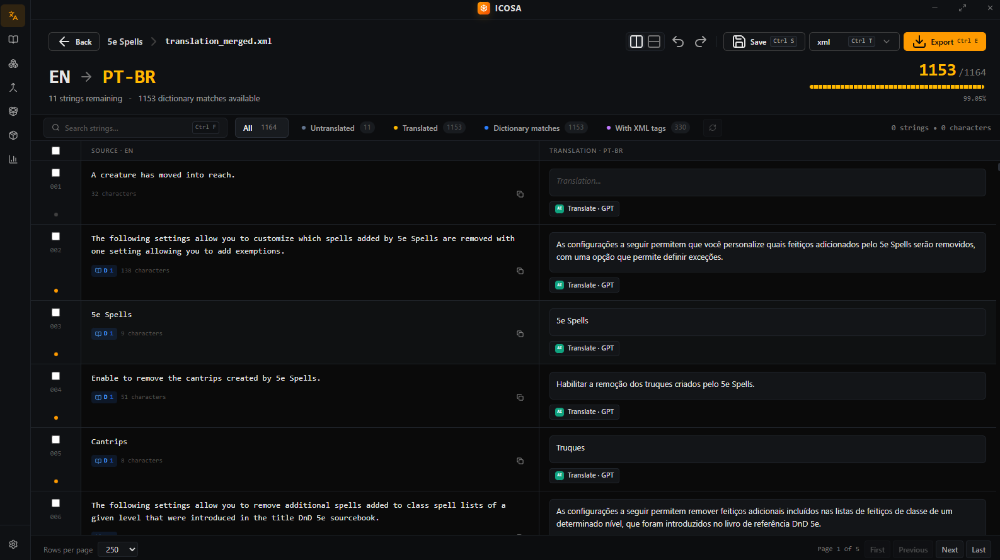

# Icosa

A desktop translator for [Baldur's Gate 3](https://baldursgate3.game) mods.

Icosa is for people who localize mods: you drop in a localization XML, a `.pak`, or a zip, pick a language pair, and work through the strings in an editor that actually understands BG3's format. Dictionary matches fill in what you have already translated, AI and machine translation can take the first pass, and when you are done you export an XML, a zip, or a playable `.pak`.

The app is a Windows desktop tool. You do not need Larian's toolkit, `.NET`, or [Divine.exe](https://github.com/Norbyte/lslib) installed. Packing and unpacking `.pak` files is built in.



## Download

For now Icosa ships as a **Windows portable** build only (64-bit). Grab the latest `.exe` from [Releases](https://github.com/Kaironn2/BG3-Mod-Translator-Desktop/releases) and run it. There is no installer and nothing extra to install.

macOS and Linux packages are not published yet.

The UI is available in **English** and **Portuguese (Brazil)**.

## How a translation session works

1. Choose source and target languages. Official BG3 locales are marked and sort first; export uses Larian's folder names (`English`, `BrazilianPortuguese`, `LatinSpanish`, and so on).
2. Pick an existing mod or create a new one. Each mod keeps its own dictionary and progress.
3. Drop a `.xml`, `.pak`, or `.zip`. If the package has more than one localization file, Icosa asks which XML to open.
4. Translate in the editor, save to the dictionary, then export.



The editor is a side-by-side (or stacked) grid over the localization strings. You can search, filter untranslated / translated / dictionary matches / XML-tagged lines, translate one row or a batch, and export as XML, `.pak`, or zip.

## What Icosa does

**Translate.** Manual typing, DeepL, Google Translate, or AI. Select rows and send a batch; the bar at the bottom can use DeepL, Google, or any AI you have keyed. Per-row AI buttons open a prompt you can tweak for that string.

**Dictionary.** Every saved line becomes translation memory for later mods. Icosa matches by UID and by text, and can feed similar past translations into AI prompts so names and terms stay consistent. You can import, export, search, and replace across the dictionary.

**AI translation.** One API key per provider, used by the translate buttons:

- OpenAI
- Anthropic (Claude)
- Google Gemini
- xAI Grok
- Z.AI (GLM)
- DeepSeek

Prompts live in named slots (the default is tuned for D&D / BG3 and stays read-only; editing it forks a copy). Similarity search, concurrency, and lines-per-request are configurable per provider.

**Merge.** Combine a source file with an already-translated file into one localization XML, then keep working in the editor.

**Extract and package.** Unpack a `.pak` or zip to a folder, or pack a folder back into a BG3 `.pak`. The same pipeline is what the translator uses when you drop a package or export one.

**Manage mods.** Reorder dictionary lookup priority and delete a mod (and its dictionary rows) when you no longer need it.

**Metrics.** Track DeepL / Google character usage against a monthly quota, and see recent translation runs.

## .pak files, without Divine

Icosa reads and writes Baldur's Gate 3 **LSPK v18** packages in Node.js. The implementation follows [LSLib](https://github.com/Norbyte/lslib) (LZ4 / Zstd, file table layout, compression flags) so a mod you unpack and repack is a valid BG3 package.

That is why there is no bundled `Divine.exe` and no `.NET` runtime on the machine. A huge thank you to **[Norbyte](https://github.com/Norbyte)** for LSLib — Icosa would not exist without that work.

Supported input: localization `.xml`, `.pak`, and `.zip`. Export: `.xml`, `.pak`, and `.zip`.

## For contributors

Stack: Electron, React 19, TypeScript, Tailwind, Drizzle / SQLite, Biome. Node.js 20+ and [pnpm](https://pnpm.io) are enough.

```bash
pnpm install
pnpm dev
```

Useful scripts:

```bash
pnpm typecheck
pnpm lint
pnpm format
pnpm db:studio          # Drizzle Studio
pnpm drizzle-kit generate
pnpm build:win          # Windows package (used for the portable release)
```

VS Code with the [Biome](https://marketplace.visualstudio.com/items?itemName=biomejs.biome) extension is the usual setup. Biome replaces ESLint and Prettier here.

## Credits

- [Norbyte / LSLib](https://github.com/Norbyte/lslib) — the `.pak` format this app reimplements
- Larian Studios — Baldur's Gate 3
- Everyone who has translated a mod the hard way and wanted a calmer editor
